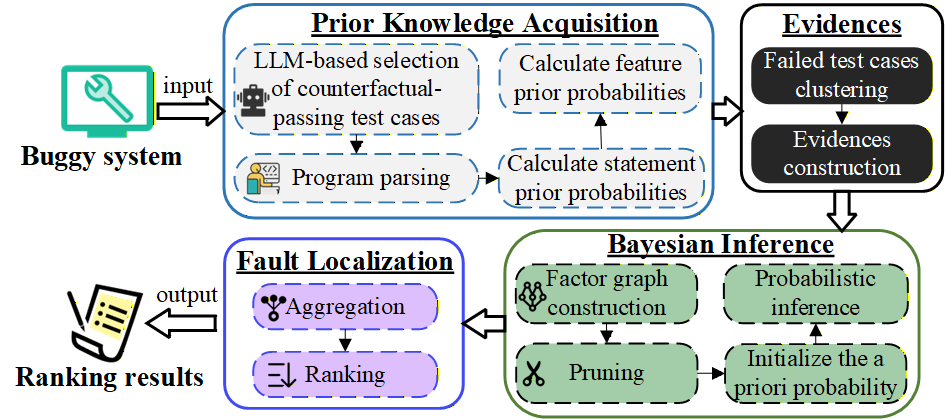

# BRFL

## Heterogeneous-Prior Bayesian Inference for Fault Localization in Software Product Lines

### Overview
In our work, we reformulate SPL fault localization as a structured probabilistic causal inference problem. 
The proposed approach models features, statements, and execution outcomes within a factor graph that captures structural and dynamic dependencies across product configurations. 
Instead of relying solely on statistical correlations, we derive heterogeneous prior probabilities from feature--outcome associations and statement-level spectra, incorporating them into Bayesian inference to guide posterior estimation. 
This integration mitigates variability-induced confounding and enables fault probabilities to be inferred without the need for additional test executions.



### How to Run BRFL

## Requirements

```sh
pip install -r requirements.txt
```
## Subject Systems

We evaluate the performance of BRFL and the baselines on eight software product lines. Among these, we constructed mutants for two larger-scale systems, TankWar and BerkeleyDB, which you can download [here](https://drive.google.com/drive/folders/1NJsldDsFs0yj2GNQYEZSJvgA7Tr7P77u?usp=drive_link). You can also download complete data versions of the other datasets [here](https://tuanngokien.github.io/splc2021/).

> **Note:** Using Javassist requires recompiling the mutants. After setting the mutant directory in `recompile_failed_products.py`, you can recompile them, as shown below.

```sh
python recompile_failed_products.py
```

After preparing the data, set the system_name and buggy_systems_folder parameters in `main.py` to execute the script directly. You can run it using the command line, for example:

```sh
python main.py --system "BankAccountTP" --buggy_systems_folder "./examples/4wise-BankAccountTP-1BUG-Full"
```

## LLM Configuration

BRFL can use a large language model to pick, for each failing test, a few counterfactual *passing* tests from the same test class. **No API key is stored in the source tree** — you supply your own model, endpoint and key through a config file or environment variables.

Copy the template and fill in your own values:

```sh
cp llm_config.example.json llm_config.json
```

```json
{
  "provider": "dashscope",
  "model": "qwen-plus",
  "base_url": "",
  "api_key": "PUT-YOUR-OWN-API-KEY-HERE",
  "temperature": 0.1,
  "top_k": 5,
  "timeout": 60
}
```

| Field | Meaning |
| --- | --- |
| `provider` | `dashscope` = Aliyun DashScope native SDK; `openai` = any OpenAI-compatible `/chat/completions` endpoint (OpenAI, DeepSeek, DashScope compatible-mode, vLLM, Ollama, ...) |
| `model` | Model name, e.g. `qwen-plus`, `gpt-4o-mini`, `deepseek-chat` |
| `base_url` | API root, required when `provider` is `openai`, e.g. `https://api.deepseek.com/v1` |
| `api_key` | Your own key. `llm_config.json` is git-ignored, so it never gets committed |
| `temperature` / `top_k` / `timeout` | Sampling temperature, number of passing tests selected per failing test, and request timeout in seconds |

Every field can also be set through the environment, which takes precedence over the file (handy on a shared machine or in CI):

```sh
export BRFL_LLM_PROVIDER=openai
export BRFL_LLM_MODEL=deepseek-chat
export BRFL_LLM_BASE_URL=https://api.deepseek.com/v1
export BRFL_LLM_API_KEY=sk-your-own-key
```

`DASHSCOPE_API_KEY` / `OPENAI_API_KEY` / `DEEPSEEK_API_KEY` are also accepted as key fallbacks, and `BRFL_LLM_CONFIG` can point at a config file outside the repository. To check what is actually in effect (the key is printed masked):

```sh
python -m pyutils.llm_config
```

The LLM step is optional. `pylib/spl_test_selection.py` provides the same selection through non-LLM strategies — `jaccard`, `random`, `embedding` and `all` (no filtering) — chosen with the `strategy` argument or the `BRFL_TEST_SELECTION` environment variable; none of them requires an API key.
